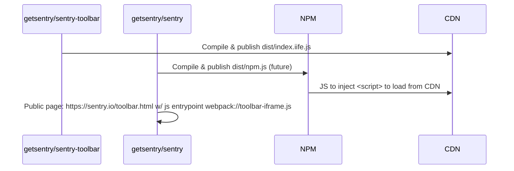
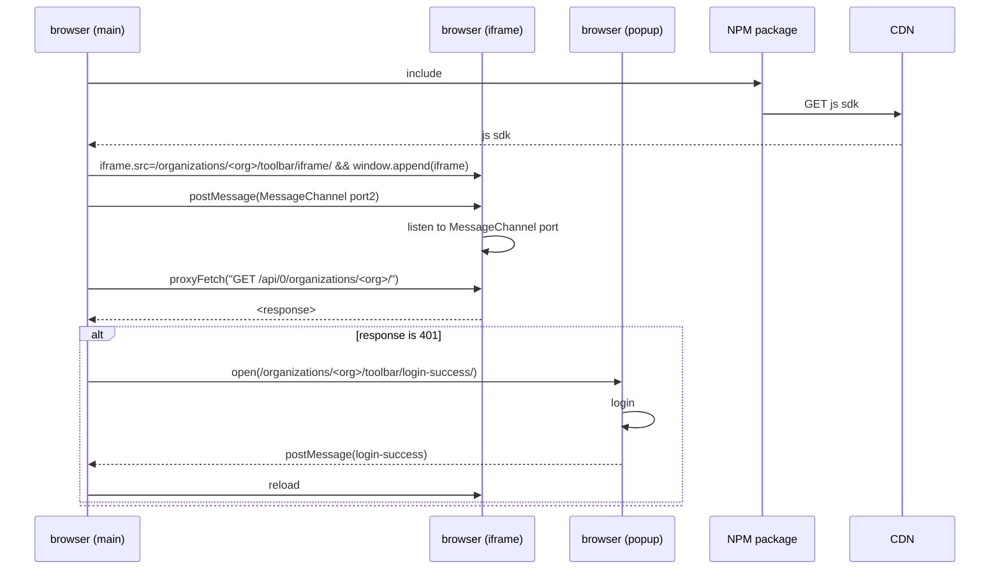
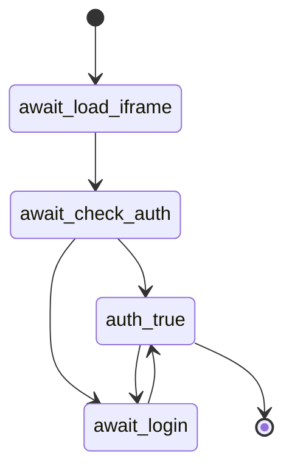

# Diagrams

## Build System and artifacts

The artifacts that we should produce for the toolbar, where they come from and where they get published to, are as follows.

* Artifact names are demonstrative until the build system is actually constructed

Basically what gets built is:
1. From the getsentry/sentry-toolbar repo, one [entrypoint](https://github.com/getsentry/sentry-toolbar/blob/934d1bbc3d0022cace1167b262614c93b27b4d6f/vite.config.ts#L22-L35) currently called `index.iife.js`. This goes onto the CDN, and can be used by adding `<script src="<CDN>/toolbar/index.iife.js"/>` to the page (pending file renames, etc)
2. From the getsentry/sentry repo, or anywhere really, we can build an NPM package that inserts the above `<script>` tag onto the page. Maybe a react-specific version too. [Sample code](https://github.com/getsentry/sentry-toolbar/blob/934d1bbc3d0022cace1167b262614c93b27b4d6f/docs/conditional-script.md) is available.

## Auth Flow

The setup flow is basically:
1. JS: Create an iframe element
  - Create a MessageChannel for the iframe
  - Listen to the MessageChannel port, resolve proxy promises based on sequence id
  - Listen to `onload` event from iframe
    - iframe.postMessage(port-init) to send the MessageChannel port into the iframe
    - send a test request to `/api/organizations` to check auth status
    - If auth check returns 401
      - await login() flow
1. JS: Set iframe src to be `/organizations/<org>/toolbar/iframe/`
  - PY: This python view the referer header against an allow-list stored in org-settings on sentry.io
  - PY: If the referer is allowed:
    - Return the iframe page
    - JS: listen to "port-init" message from iframe host
      - accept MessageChannel port reference
      - listen to new port reference
        - run messages through the messageDispatchMap
        - postMessage() results or error
  - Else:
    - Return 401, something that prevents the `onload` from firing

## SDK State

