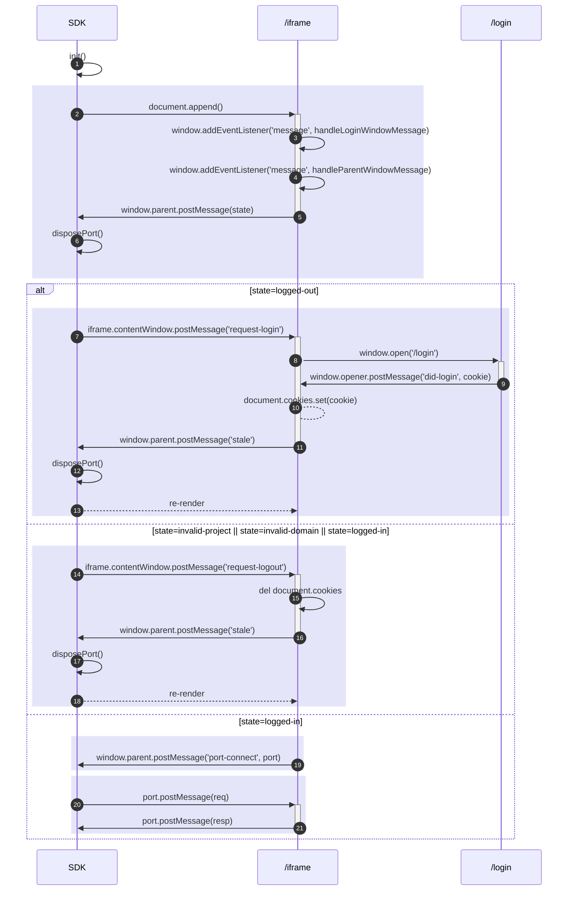
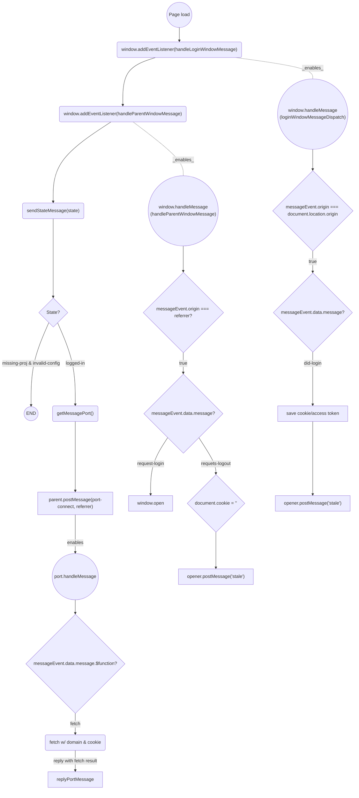

# Diagrams

## Auth Flow

```mermaid
sequenceDiagram
  participant SDK as SDK
  participant iframe as /iframe
  participant login as /login

  autonumber
  SDK ->> SDK: init()
  rect rgba(0, 0, 200, 0.1)
    SDK ->>+ iframe: document.append()
    iframe ->> iframe: window.addEventListener('message', handleLoginWindowMessage) 
    iframe ->> iframe: window.addEventListener('message', handleParentWindowMessage) 
    iframe ->>- SDK: window.parent.postMessage(state)
    SDK ->> SDK: disposePort()
  end

  alt state=logged-out
    rect rgba(0, 0, 200, 0.1)
      SDK ->>+ iframe: iframe.contentWindow.postMessage('request-login')
      iframe ->>+ login: window.open('/login')
      login ->>- iframe: window.opener.postMessage('did-login', cookie)
      iframe --> iframe: document.cookies.set(cookie)
      iframe ->>- SDK: window.parent.postMessage('stale')
      SDK ->> SDK: disposePort()
      SDK -->> iframe: re-render
    end

  else state=invalid-project || state=invalid-domain || state=logged-in
    rect rgba(0, 0, 200, 0.1)
        SDK ->>+ iframe: iframe.contentWindow.postMessage('request-logout')
        iframe ->> iframe: del document.cookies
        iframe ->>- SDK: window.parent.postMessage('stale')
        SDK ->> SDK: disposePort()
        SDK -->> iframe: re-render
    end 
  else state=logged-in
    rect rgba(0, 0, 200, 0.1)
      iframe ->> SDK: window.parent.postMessage('port-connect', port)
    end

    rect rgba(0, 0, 200, 0.1)
      SDK ->>+ iframe: port.postMessage(req)
      iframe ->>- SDK: port.postMessage(resp)
    end
  end
```

```mermaid
flowchart TB
    pageLoad(("Page load")) --> listenLogin("window.addEventListener(handleLoginWindowMessage)")
    listenLogin --> listenParent("window.addEventListener(handleParentWindowMessage)")
    listenParent --> sendState("sendStateMessage(state)")
    
    sendState --> checkState{"State?"}
    checkState -- "missing-proj & invalid-config" --> wait(("END"))
    checkState -- "logged-in" --> getPort("getMessagePort()")
    getPort --> parentPost["parent.postMessage(port-connect, referrer)"]

    listenLogin -. _enables_ .- window.handleLogin(("window.handleMessage<br/>(loginWindowMessageDispatch)"))
    window.handleLogin --> originIsSame{"messageEvent.origin === document.location.origin"}
    originIsSame -- true --> checkLoginMessage{"messageEvent.data.message?"}
    checkLoginMessage -- "did-login" --> saveAccessToken["save cookie/access token"]
    saveAccessToken --> opener.postMessage1["opener.postMessage('stale')"]

    listenParent -. _enables_ .- window.handleParent(("window.handleMessage<br/>(handleParentWindowMessage)"))
    window.handleParent --> originIsReferrer{"messageEvent.origin === referrer?"}
    originIsReferrer -- true --> checkParentMessage{"messageEvent.data.message?"}
    checkParentMessage -- "request-login" --> window.open["window.open"]    
    checkParentMessage -- "requets-logout" --> clearCookie{"document.cookie = ''"}
    clearCookie --> opener.postMessage2["opener.postMessage('stale')"]
    
    parentPost -- enables --> port.handleMessage(("port.handleMessage"))
    port.handleMessage --> checkPortMessage{"messageEvent.data.message.$function?"}
    checkPortMessage -- fetch --> fetch("fetch w/ domain & cookie")
    fetch -- reply with fetch result --> replyPortMessage
```
