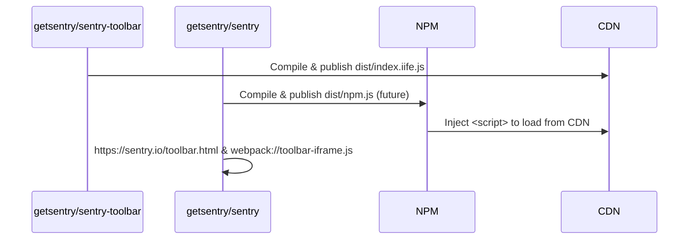
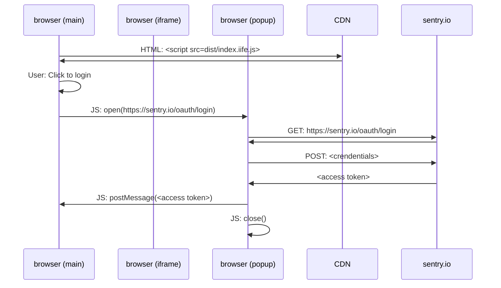
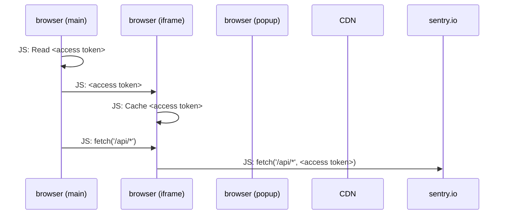

# Diagrams

## Build System and artifacts

The artifacts that we should produce for the toolbar, where they come from and where they get published to, are as follows.

* Artifact names are demonstrative until the build system is actually constructed

## Auth Flow

## Runtime

